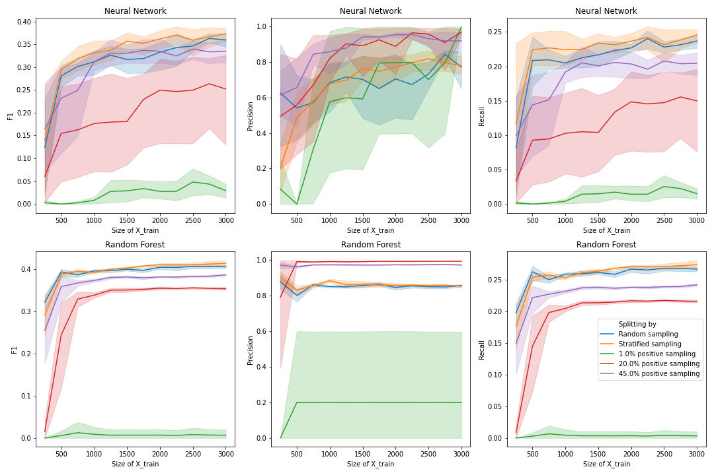

# Active Learning For Classifying Protein-Protein Interactions
This project is done as part of the course [02901 Advanced Topics in Machine Learning](https://kurser.dtu.dk/course/02901) August 2020. 

The aim is to reproduce and possibly improve some of the results of the following paper:
> Mohamed, T. P., Carbonell, J. G., & Ganapathiraju, M. K. (2010). Active learning for human protein-protein interaction prediction. *BMC bioinformatics, 11*(S1), S57.

Focusing on: 
* How the dataset is splitted into training and test: random, sample `X%` of positive labels to be in training set, or maintain the y proportion in train and test sets.
* Compare the effect of two different classifiers: Random Forest vs Linear Neural Network

## Data preparation
Data source: http://www.cs.cmu.edu/~qyj/papers_sulp/proteins05_pages/feature-download.html

To prepare the data for the active learning system, run `data_prepare.py`. Basically, it combines the files into one and reduces the feature groups to 0s and 1s. 0 means feature is absent and 1 means feature is present.

## Run active learning
The script `main.py` contains the code for testing the different active learning systems. It needs two files as input: feature file (X) and output labels (y). 
There are two arguments that can additionally be added:
* `-add_n`: Add n samples from pool in each iteration (by default 1)
* `-threshold`: Desired threshold to reach on test set (by default 0.7)

Example on how to run the script:
```python
python3 main.py -X data/protein_interaction_X_reduced.csv -y data/protein_interaction_y.csv -an 250
```

## Visualize results
The results can be visualized with the code located in `viz.py`.

With the command listed in the example in the previous section, the visualization looks like this:

